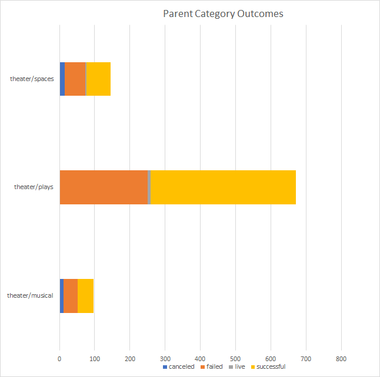

# Comprehensive Analysis of Kickstarter Campaigns
A total of 4115 Kickstarter campaigns were analysed in order to uncover trends and with the results, refine the business plan. 

The graph 1 - Parent Category Outcomes summarize how the campaigns performed.

From all US Kickstarter campaigns, the analysis shows that the theater category has the greatest number of campaigns on Kickstarter, with almost 1,000. The campaigns get, on average, 25% more than the original goal and have a successful rate of 58%.

The graph 2 – Theater Category Outcomes summarize the above.

As comparison, the technology category is the one that brings more money, with an average of 2430% more than the original goal. Although these campaigns draw a good amount of money, they carry a very high-risk factor and most of the campaigns end up in failure. Only 38% of the campaigns are successful.
                                                         
Analysing the campaigns in the US that funded theater plays, the average that the plays are funded is $4,000. This fact does not seem encouraging, however from the plays asking for $10,000, 60% of those were successful and got on average 11% more that the initial goal.

The analysis shows that there is a good tendency that a $10,000 campaign can reach success, however there are factors that the number do not reveal. If the decision is to go forward with the campaign, a proper marketing of the campaign and advertising can be a game changer.
